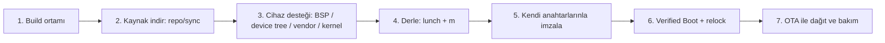

# 2. Custom ROM Nedir, Nasıl Yapılır

## 2.1 Tanım

**Custom ROM**, bir cihazın fabrika işletim sisteminin yerine geçen, **kaynaktan
derlenmiş ve sizin anahtarlarınızla imzalanmış** bir Android işletim sistemidir. İki
yaygın taban vardır:

- **Saf AOSP** (Android Open Source Project): Google'ın açık kaynak Android'i. Tam kontrol,
  ama her şeyi kendiniz kurarsınız.
- **Hazır türev** (LineageOS, /e/OS, GrapheneOS vb.): AOSP üstüne cihaz desteği ve
  özellikler eklenmiş tabanlar. Daha hızlı başlangıç, ama tabanın kısıtlarına tabisiniz.

!!! info "Ticari kullanım ve lisans"
    AOSP çekirdeği **Apache 2.0**, Linux çekirdeği **GPLv2** lisanslıdır; ticari ürün
    yapmak serbesttir. LineageOS gibi türevler de büyük ölçüde ticari kullanıma açıktır,
    ama bazı toplulukların (ör. GrapheneOS) **markalama/rebrand** konusunda hassasiyetleri
    vardır — türev tabanı seçerken lisans + topluluk politikası ayrı ayrı incelenmelidir.

## 2.2 Uçtan uca süreç (production odaklı)

Aşağıdaki akış, gerçek cihazda çalışacak imzalı bir ROM üretmenin standart adımlarıdır.



### Adım 1 — Build ortamı
Linux (tercihen Ubuntu), **64-bit, en az 8 çekirdek, 16 GB+ RAM (32 GB önerilir), 400 GB+
boş SSD**. Kaynak indirme "birkaç saat", ilk derleme çok çekirdekli makinede ~40 dk,
zayıf makinede 3 saati bulabilir. ([emteria — AOSP ROM](https://emteria.com/blog/aosp-rom))

### Adım 2 — Kaynağı indir (`repo`)
Google'ın `repo` aracıyla dev kaynak ağacı çekilir:

```bash
repo init -u https://android.googlesource.com/platform/manifest -b android-15.0.0_rXX
repo sync -c -j$(nproc)
```

Doğru branch numaraları için Google'ın [build numbers](https://source.android.com/docs/setup/reference/build-numbers)
sayfası kullanılır. ([Android kurulum dokümanı](https://source.android.com/docs/setup/about))

### Adım 3 — Cihaz desteği (BSP / device tree / vendor / kernel)

!!! danger "İşin en kritik ve en pahalı adımı budur"
    AOSP'nin **üst katmanı** (framework) açık kaynaktır, ama donanımı çalıştıran katman
    değildir. Her cihaz için şunlar gerekir:

    - **Device Tree** — cihaza özel yapılandırma
    - **Vendor blob'ları** — modem, GPU, kamera, NFC gibi bileşenlerin kapalı kaynak
      sürücü/firmware'leri
    - **Kernel kaynağı** — cihaza özel çekirdek

    Bunlar bir arada **BSP (Board Support Package)** olarak anılır. emteria'nın deyimiyle:
    *"BSP yoksa geliştirme süresi ve maliyet fırlar."*
    ([emteria](https://emteria.com/blog/aosp-rom))

Bu adım, cihazı nereden aldığınıza göre değişir:

- **Pixel (referans cihaz):** Google vendor blob'larını resmî yayınlar; device tree
  AOSP'de. Yani bu adım büyük ölçüde hazırdır.
- **ODM kutu (Rockchip vb.):** ODM size o kart için çalışan BSP'yi verir (ör.
  [TinkerBoard RK3588 device repo](https://github.com/TinkerBoard-Android/rockchip-android-device-rockchip-rk3588),
  [rockchip-linux/kernel](https://github.com/rockchip-linux/kernel)).
- **Rastgele bir telefon:** BSP'yi genelde bulamazsınız → ticari üründe uygun değildir.
  (Detay: [Bölüm 6](06-donanim-tedarik.md).)

### Adım 4 — Derle
```bash
source build/envsetup.sh
lunch <hedef>-user      # üretim için "user"; geliştirme için "userdebug"
m -j$(nproc)
```

Modern AOSP, **Soong** build sistemini kullanır (`Android.bp` dosyaları); eski `make`
sisteminin yerini almıştır. Çıktı, cihaza yazılabilir imaj dosyalarıdır.

### Adım 5 — Kendi anahtarlarınla imzala (production'ın olmazsa olmazı)

!!! warning "Test anahtarlarıyla üretime çıkılmaz"
    AOSP ağacı `build/target/product/security` altında **herkese açık test anahtarları**
    ile gelir; `make` bunlarla imzalar. Bu anahtarlar **kamuya açıktır**, üretimde
    kullanılırsa herkes sizin imzanızı taklit edebilir.
    ([Android — Sign builds for release](https://source.android.com/docs/core/ota/sign_builds))

Beş anahtar çifti vardır: **releasekey, platform, shared, media, networkstack**. Her biri
bir sertifika (`.x509.pem`) + gizli anahtar (`.pk8`) dosyasıdır.

```bash
# 1) Kendi release anahtarlarınızı üretin
subject='/C=TR/ST=Istanbul/L=Istanbul/O=MobileITM/OU=Mobile/CN=MobileITM/emailAddress=...'
make_key releasekey   "$subject"
make_key platform     "$subject"
make_key shared       "$subject"
make_key media        "$subject"
make_key networkstack "$subject"

# 2) Derlenen (imzasız) target-files zip'ini kendi anahtarlarınızla yeniden imzalayın
./build/make/tools/releasetools/sign_target_files_apks \
    --default_key_mappings /güvenli/yol/anahtarlar \
    -o signed-target_files.zip \
    unsigned-target_files.zip
```

Kaynak: [Android — Sign builds for release](https://source.android.com/docs/core/ota/sign_builds),
[Creating Release Keys and Signing Builds](https://wladimir-tm4pda.github.io/porting/release_keys.html).

### Adım 6 — Verified Boot ve relock
İmzalı imajın boot zincirine bağlanması ([Bölüm 3](03-sikilastirma.md)'te derinlemesine):
`avbtool` ile kendi AVB anahtarınız üretilir, `vbmeta` imzalanır, cihaza yüklenir ve
bootloader kendi anahtarınızla **geri kilitlenir**. Bundan sonra cihaz **yalnızca sizin
imzaladığınız OS'u** açar.

### Adım 7 — OTA ile dağıt ve bakım
İmzalı `target-files`'tan OTA paketi üretilir ve kendi sunucunuzdan dağıtılır:

```bash
ota_from_target_files -k /güvenli/yol/releasekey \
    signed-target_files.zip signed-ota_update.zip
```

!!! danger "Anahtar disiplini — geri dönüşü yok"
    OTA paketleri, **fabrika imajını imzalayan anahtarın aynısıyla** imzalanmalıdır; aksi
    halde cihaz güncellemeyi reddeder. Anahtarlarınızı kaybederseniz sahadaki cihazlara
    bir daha güncelleme gönderemezsiniz. Anahtarlar HSM/kasa gibi güvenli ortamda saklanmalı.
    ([Android — Sign builds for release](https://source.android.com/docs/core/ota/sign_builds))

## 2.3 "Fiziksel telefona flash" yolu (bağlam için)

İnternette en çok rastlanan rehberler (XDA, LineageOS) **belirli bir mevcut telefona ROM
basma** senaryosunu anlatır: bootloader unlock → TWRP (custom recovery) → recovery'den
zip flash. Bu **hobici/tek cihaz** yoludur ve şu iki adım yüzünden ticari üretime
uymaz:

- Cihaza özel device tree/vendor'ı **XDA'dan bulmak** (gönüllü bakıma bağlı, kırılgan).
- **TWRP ile elle flash** — binlerce cihazda ölçeklenmez.

Production'da bunun yerine **fabrika/provizyon hattı** (fastboot ile otomatik yazma +
relock + test) veya doğrudan **OEM/ODM'in fabrikada sizin imajı yüklemesi** kullanılır.

## 2.4 Özet karar

| Taban seçimi | Ne zaman | Not |
|---|---|---|
| Saf AOSP | Tam kontrol, kendi ürününüz | En çok emek, en çok esneklik |
| LineageOS | Telefonda hızlı başlangıç | Cihaz desteği gönüllüye bağlı |
| GrapheneOS | Sıkılaştırma **referansı** olarak incele | Ürün tabanı yapma; rebrand hassasiyeti |
| ODM BSP | Signage / gömülü kutu | Sürücü sorumluluğu ODM'de (en kolay) |

---

!!! note "Bu bölümün kaynakları"
    - [Android — Sign builds for release](https://source.android.com/docs/core/ota/sign_builds)
    - [Android — Kurulum / Genel bakış](https://source.android.com/docs/setup/about)
    - [emteria — Building an AOSP ROM](https://emteria.com/blog/aosp-rom)
    - [Creating Release Keys and Signing Builds](https://wladimir-tm4pda.github.io/porting/release_keys.html)
    - [Guide To Sign Android Build With Private Release Keys (gist)](https://gist.github.com/neilchetty/22ae18f5404c460de2a9372812803026)
    - [dhina17 — How to start Android custom ROM development](https://blog.dhina17.dev/how-to-start-android-custom-rom-development)
    - [TinkerBoard RK3588 device repo](https://github.com/TinkerBoard-Android/rockchip-android-device-rockchip-rk3588)
