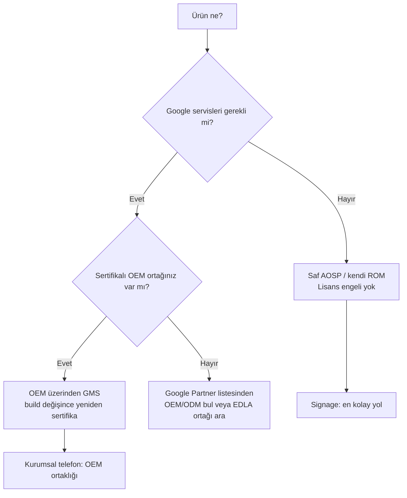

# 5. Lisanslama ve Ticari Engeller (GMS / EDLA)

!!! danger "Bu, projenin en büyük ticari engelidir"
    Kendi ROM'unuzu kurduğunuz anda cihaz **Google sertifikasını kaybeder**: Play Store,
    Google Play Services, Chrome, Gmail, Google hesabı ve FCM push'un Google tarafı
    **gitmiştir**. Cihaz "saf AOSP" olur — tıpkı Çin pazarındaki Google'sız Android'ler
    gibi. ([Jason Bayton — Certifying Android devices](https://bayton.org/blog/2024/01/certifying-android-devices/))

## 5.1 GMS / Play Protect sertifikası nedir?

**GMS (Google Mobile Services)** sertifikası — yeni adıyla **Play Protect Certification** —
bir cihazın Google servislerini yasal ve teknik olarak önyükleyebilmesi için gereken
onaydır. İki şeyi birleştirir:

- **CDD (Compatibility Definition Document)** — teknik uyumluluk kuralları.
- Google'ın tescilli anlaşmaları (aşağıdaki MADA/EDLA).

Teknik uyum, **CTS/GTS/VTS** gibi test paketleriyle ölçülür (uyumluluk, Google servisleri,
satıcı arayüzü testleri).

## 5.2 MADA vs EDLA

| | **MADA** (ve eMADA/iMADA) | **EDLA** |
|---|---|---|
| Açılım | Mobile Application Distribution Agreement | Enterprise Device License Agreement |
| Hedef | Tüketici telefon/tablet | Kurumsal / standart-dışı form faktörleri |
| Ekran | 3.3"–18" | 18"+ olabilir, **70"'e kadar** |
| Batarya | Zorunlu | **Bataryasız olabilir** |
| Tipik cihaz | Telefon, tablet | **Signage, kiosk, POS**, ticari ekran, sağlamlaştırılmış cihaz |
| Onay ömrü | ~2 yıl | **~5 yıl** (daha uzun yaşam döngüsü) |
| Sertifikasyon süresi | — | ~6–8 hafta |

Kaynak: [Jason Bayton — GMS vs EDLA](https://bayton.org/android/android-enterprise-faq/gms-vs-edla-enterprise/),
[BenQ — What is Google EDLA](https://www.benq.com/en-us/education/edtech-blog/what-is-google-edla.html),
[Deeplight — GMS & EDLA](https://www.dlcen.com/edla/759.html),
[Zhongle — GMS certification](https://www.zhongletest.com/en/certification/177.html).

!!! info "Signage için doğru kapı EDLA'dır"
    Havalimanı/AVM ekranı gibi **bataryasız, büyük ekranlı, adanmış** cihazlar tam olarak
    EDLA kapsamındadır. Ama önemli nüans: **signage ürününüz Google servislerine ihtiyaç
    duymuyorsa EDLA'ya da gerek yoktur** — saf AOSP yeterlidir (bkz. §5.4).

## 5.3 Kim doğrudan sertifika alabilir? (Kritik kısıt)

!!! warning "Yeni bir şirket doğrudan GMS alamaz — ortak şart"
    Google, imzalı anlaşması olan **yaklaşık 100 onaylı partner** ile çalışır. Küçük/yeni
    bir firma tipik olarak **kendi başına GMS sertifikası alamaz**. Anlaşması olmayan
    firmalar, Google'ın [Partner listesindeki](https://www.android.com/certified/partners/)
    sertifikalı bir **OEM/ODM üzerinden** gitmek zorundadır; tasarım, üretim ve Google'ın
    test laboratuvarlarına (3PL) başvuruyu bu partner yürütür.
    ([Jason Bayton — Certifying Android devices](https://bayton.org/blog/2024/01/certifying-android-devices/))

Bu, "General Mobile'dan ROM + imza alan firma" modelinin neden mantıklı olduğunu açıklar:
**GMS'i olan sertifikalı bir OEM'in üstüne** kurmak, sıfırdan sertifika almaktan çok daha
kısa yoldur.

## 5.4 İş modeline etkisi (özet karar)

=== "Signage / kiosk"

    - **GMS gerekmez** → saf AOSP yeterli, hatta tercih edilir.
    - ✅ **En kolay giriş.** Lisans engeli fiilen yok.
    - İçerik/güncelleme kendi altyapınızla (MDM + OTA) yönetilir.

=== "Kurumsal sıkılaştırılmış telefon"

    - Müşteri **Play Store/WhatsApp istemiyorsa** (savunma, saha, güvenli iletişim) →
      GMS'siz, saf AOSP olur. ✅
    - Müşteri **Play Store istiyorsa** → **OEM ortaklığı şart** (General Mobile modeli).
    - GMS sertifikası **belirli bir build'e** verilir; siz build'i değiştirdiyseniz OEM
      üzerinden **yeniden sertifikasyon** gerekir — anlaşmada bu madde netleştirilmeli.

## 5.5 Maliyet ve süre (yaklaşık)

Açık kaynaklardan derlenen yaklaşık büyüklükler (kesin rakamlar Google/OEM ile NDA altında
belirlenir, doğrulanmalıdır):

- **EDLA sertifikasyon süresi:** ~6–8 hafta (testler + onay).
- **Cihaz onay ömrü:** EDLA ~5 yıl, MADA ~2 yıl.
- **OEM tarafında özelleştirme NRE:** Örn. custom bootloader sıkılaştırması gibi
  kalemler orta segment OEM cihazına **~$85k NRE** ekleyebilir (kaynak tahmini).
  ([Alibaba — OEM smartphone guide](https://electronics.alibaba.com/buyingguides/oem-smartphone-manufacturer-guide))
- **Google güvenlik desteği:** Google, sertifikalı bir Android sürümüne genelde ~3 yıl
  güvenlik yaması sağlar; sonrası OEM'in sorumluluğuna geçer.

!!! note "Yasal uyarı"
    Bu rakamlar açık kaynaklara dayalı **kaba tahminlerdir**. Bağlayıcı planlama öncesi
    Google Android Partner ekibi ve hedef OEM/ODM ile doğrudan görüşülmelidir.

## 5.6 Karar ağacı

---

!!! note "Bu bölümün kaynakları"
    - [Jason Bayton — Certifying Android devices](https://bayton.org/blog/2024/01/certifying-android-devices/)
    - [Jason Bayton — GMS vs EDLA](https://bayton.org/android/android-enterprise-faq/gms-vs-edla-enterprise/)
    - [BenQ — What is Google EDLA](https://www.benq.com/en-us/education/edtech-blog/what-is-google-edla.html)
    - [Deeplight — GMS & Android 14 EDLA](https://www.dlcen.com/edla/759.html)
    - [emteria — GMS certification guide](https://emteria.com/learn/google-mobile-services)
    - [einfochips — How to obtain GMS license](https://www.einfochips.com/blog/how-to-obtain-googles-gms-license-for-android-devices/)
    - [Android Certified Partners](https://www.android.com/certified/partners/)
