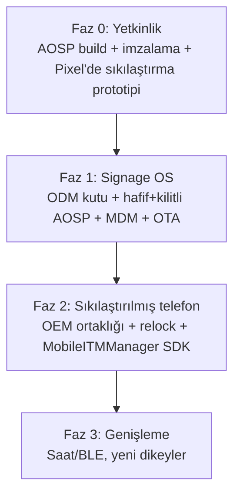

# 9. Değerlendirme ve Yol Haritası

## 9.1 Genel değerlendirme

İşverenin vizyonu — **politikadan OS sahipliğine geçmek** — teknik olarak sağlam ve
oturmuş bir yola dayanıyor. Ancak "her şeyi aynı anda" yapmaya çalışmak iki sert engele
(GMS lisanslama ve BSP/sürücü) toslar. Doğru strateji, **engellerin en zayıf olduğu
üründen başlayıp** kazanılan altyapıyı yukarı taşımaktır.

**Fizibilite özeti:**

| Boyut | Değerlendirme |
|---|---|
| Teknik yapılabilirlik | ✅ Yüksek — süreç açık ve belgeli |
| Signage ürünü | ✅ Düşük risk, hızlı pazara çıkış |
| Sıkılaştırılmış telefon | ⚠️ Orta — OEM ortaklığına bağlı |
| GMS'li tüketici cihazı | ❌ Zor — sertifikasyon/ortak şart |
| Rastgele telefona ROM | ❌ Elenmeli — BSP/relock kısıtı |
| Akıllı saat | ⏸️ Ertelenmeli — ayrı proje |
| MDM altyapısının kaldıracı | ✅ Güçlü avantaj |

## 9.2 SWOT

=== "Güçlü yönler"

    - Hazır **MDM backend + ajan** (en pahalı yazılım parçası)
    - Mevcut cihaz filosu ve müşteri ilişkileri (Hikvision dahil)
    - Abonelik iş modeli zaten oturmuş

=== "Zayıf yönler"

    - AOSP/ROM derinliğinde ekip yetkinliği henüz kurulacak
    - Sürekli güvenlik yaması + OTA bakımı için süreç yok
    - İmza anahtarı yönetimi (HSM/kasa) altyapısı yok

=== "Fırsatlar"

    - Signage'de donanım+SaaS geliri ("cihazdan para")
    - Sıkılaştırılmış kurumsal telefonda niş pazar (kamu/savunma)
    - Hikvision ile olası OEM ortaklığı

=== "Tehditler"

    - GMS lisans kısıtı (ortaksız aşılamaz)
    - Google'ın 3 yıl sonrası yama sorumluluğunun üzerinize geçmesi
    - ODM/OEM bağımlılığı ve NRE maliyetleri

## 9.3 Aşamalı yol haritası

### Faz 0 — Yetkinlik ve prototip (öğrenme)
- AOSP'yi kaynaktan derle, kendi anahtarlarınla imzala.
- Bir **Pixel'de** uçtan uca sıkılaştırma prototipi: custom AVB anahtarı + relock + MDM
  ajanı priv-app + basit `MobileITMManager` servisi.
- Çıktı: hem ekip yetkinliği hem OEM görüşmelerinde gösterilecek **çalışan demo**.

### Faz 1 — Signage OS (ilk gelir)
- ODM (Rockchip) ile 1–2 örnek kutu + BSP.
- Debloat + branding + kilitli launcher + MDM entegrasyonu + kendi OTA sunucusu.
- 5–10 ekranlık pilot → toplu sipariş → marka baskısı.
- Gelir: donanım + **aylık içerik/yönetim aboneliği** + reklam payı.

### Faz 2 — Sıkılaştırılmış telefon
- OEM ortaklığı (Hikvision / General Mobile tipi): BSP + imza anahtarı lisanslama.
- Fabrikada sizin imajınız + kilitli bootloader.
- `MobileITMManager` SDK'sının olgunlaştırılması.
- Gerekirse OEM üzerinden GMS yeniden sertifikasyonu.

### Faz 3 — Genişleme
- Akıllı saat / BLE aksesuarları (ayrı gömülü proje olarak).
- Yeni dikey pazarlar (sağlık, lojistik, perakende kiosk).

## 9.4 Riskler ve azaltımları

| Risk | Etki | Azaltım |
|---|---|---|
| GMS alınamaması | Tüketici cihazı yapılamaz | Signage'e odaklan (GMS gerekmez); telefonda OEM ortağı |
| BSP bulunamaması | Cihaz düzgün çalışmaz | Yalnızca ODM/OEM'in BSP verdiği cihazları seç |
| Anahtar kaybı | Sahadaki cihazlar güncellenemez | HSM/kasa + yedekleme + erişim disiplini |
| Yama bakımının aksaması | Güvenlik açığı, itibar | Aylık ASB süreci + otomatik OTA hattı |
| ODM/OEM bağımlılığı | Fiyat/tedarik riski | İkinci kaynak, sözleşmede BSP/anahtar hakları |
| Ekip yetkinliği | Gecikme | Faz 0'a yatırım, gerekirse danışman/emteria benzeri kısayol |

## 9.5 İlk 90 gün için somut adımlar

1. **Hafta 1–3:** AOSP build ortamı kur, ilk imzalı build'i çıkar (Pixel hedefi).
2. **Hafta 3–6:** Pixel'de relock + MDM priv-app + basit özel sistem servisi prototipi.
3. **Hafta 4–8 (paralel):** 2–3 Rockchip ODM'den örnek kutu + BSP + teklif al.
4. **Hafta 8–12:** ODM kutuda signage firmware prototipi + bir müşteride mini pilot planı.
5. **Sürekli:** İmza anahtarı yönetimi (HSM/kasa) ve OTA sunucusu altyapısını kur.

## 9.6 Karar önerisi

!!! success "Öneri"
    **Faz 0 + Faz 1'e yeşil ışık yakın.** Signage OS, en düşük riskle "OS sahipliği"
    yetkinliğini kazandırır, gerçek gelir üretir ve mevcut MDM varlığınızı yükseltir.
    Sıkılaştırılmış telefon (Faz 2) için paralel olarak **Hikvision ve/veya General Mobile
    ile OEM ortaklığı görüşmeleri** başlatın — ama telefon ürününe tam yatırımı Faz 1'den
    öğrenilenler ve çalışan bir demo elde olduktan sonra yapın.

---

!!! note "Bu bölümün kaynakları"
    Bu bölüm, raporun tamamındaki bulguların sentezidir; kaynaklar için ilgili bölümlere
    ve [Bölüm 10 — Kaynakça](10-kaynakca.md)'ya bakınız.
